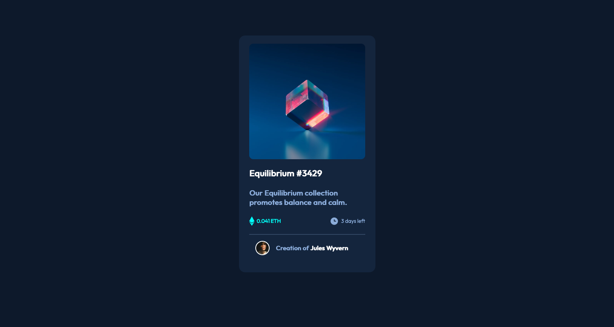

# Frontend Mentor - NFT preview card component solution

This is a solution to the [NFT preview card component challenge on Frontend Mentor](https://www.frontendmentor.io/challenges/nft-preview-card-component-SbdUL_w0U). Frontend Mentor challenges help you improve your coding skills by building realistic projects.

## Table of contents

- [Overview](#overview)
  - [The challenge](#the-challenge)
  - [Screenshot](#screenshot)
  - [Links](#links)
- [My process](#my-process)
  - [Built with](#built-with)
  - [What I learned](#what-i-learned)
  - [Continued development](#continued-development)
  - [Useful resources](#useful-resources)
- [Author](#author)
- [Acknowledgments](#acknowledgments)

**Note: Delete this note and update the table of contents based on what sections you keep.**

## Overview

### The challenge

Users should be able to:

- View the optimal layout depending on their device's screen size
- See hover states for interactive elements

### Screenshot

### Links

- Solution URL: [Add solution URL here](https://jamgorilla.github.io/nft-card/app/public/)

## My process

### Built with

- Semantic HTML5 markup
- CSS custom properties
- Flexbox
- Desktop and Mobile the same as using fixed dimensions

### What I learned

~ Learned the difference between using img and href for

~ Learned the difference in using align-items (aligns with the row) and align-content (aligns within the container as long as there are multiple rows and extra space)

~ Learned to use CSS variables

~ Learned how to load custom fonts

~ Practiced using hover states

~ Practiced use of relative and absolute to create cyan overlay effect when hovering

### Continued development

Use this section to outline areas that you want to continue focusing on in future projects. These could be concepts you're still not completely comfortable with or techniques you found useful that you want to refine and perfect.

~ Need continued practice with structuring responsive elements

~ Better understanding of when to use different units

~ Need more practice with GitHub

~ Need to learn Grid and SCSS

### Useful resources

- Kevin Powell youtube channel
- Stack overflow

## Author

- Website - [James Murphy](https://www.your-site.com)
- Frontend Mentor - [@yourusername](https://www.frontendmentor.io/profile/yourusername)
